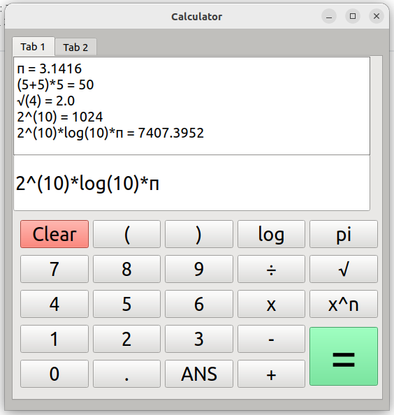

# PyQt 계산기

PyQt로 만든 GUI 계산기. Qt Designer로 화면을 잡고(`.ui`) 파이썬에서 로드해 동작을 붙였다.



---

## 구성

```
calculator_hsj_v3.ui    Qt Designer로 만든 화면 정의
calculator_hsj_v3.py    .ui 로드 + 버튼 동작
```

화면과 로직을 분리해 두어, 배치를 바꿀 때 Qt Designer에서 `.ui`만 수정하면 된다.

---

## 실행

```bash
pip install PyQt5
python calculator_hsj_v3.py
```

---

## 라이선스

MIT
